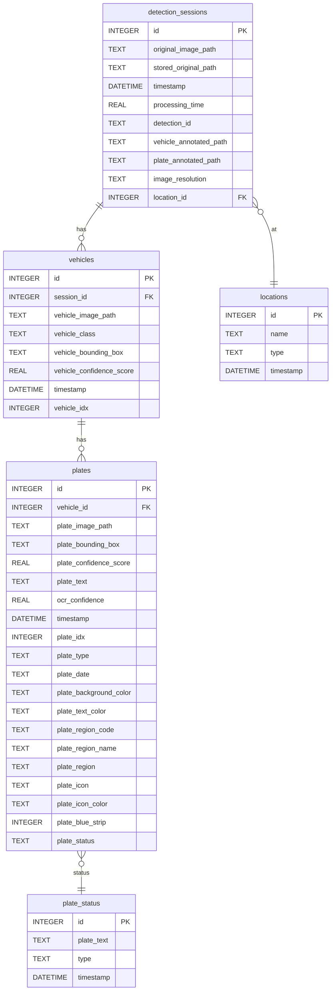

# Galaxy ALPR App – Database

This folder manages the relational database for the Galaxy ALPR (Automatic License Plate Recognition) App. It provides persistent storage for vehicle detections, license plates, session logs, and location metadata.

## Project Purpose

The database is designed to:
- Store all vehicle and license plate detections from the ALPR pipeline.
- Track detection sessions, including images, processing times, and locations.
- Maintain metadata for each vehicle and plate, including region, type, and status (whitelist/blacklist).
- Support analytics, dashboard statistics, and API queries for the backend.

---

## Tech Stack

- **Database:** SQLite (default, file-based, easy for local/dev; can be swapped for PostgreSQL or others)
- **ORM/Access:** Python `sqlite3` module (see `database.py`)
- **Schema Management:** Programmatic migrations in `database.py` (no external migration tool required)
- **Directory:** All schema and DB logic is in the `database/` folder

---

## Entity-Relationship (ER) Diagram



---

## Schema Outline

### detection_sessions
- `id` (PK): Unique session ID
- `original_image_path`: Path to uploaded image
- `stored_original_path`: Path to stored copy in outputs
- `timestamp`: Detection time (WITA/GMT+8)
- `processing_time`: Time taken for detection (seconds)
- `detection_id`: Unique string for session
- `vehicle_annotated_path`: Path to annotated vehicle image
- `plate_annotated_path`: Path to annotated plate image
- `image_resolution`: e.g. "1920x1080"
- `location_id` (FK): Reference to `locations.id`

### vehicles
- `id` (PK): Unique vehicle ID
- `session_id` (FK): Reference to `detection_sessions.id`
- `vehicle_image_path`: Path to cropped vehicle image
- `vehicle_class`: e.g. "car", "motorcycle"
- `vehicle_bounding_box`: JSON array [x1, y1, x2, y2]
- `vehicle_confidence_score`: Detection confidence (float)
- `timestamp`: Detection time
- `vehicle_idx`: Index within session

### plates
- `id` (PK): Unique plate ID
- `vehicle_id` (FK): Reference to `vehicles.id`
- `plate_image_path`: Path to cropped plate image
- `plate_bounding_box`: JSON array [x1, y1, x2, y2]
- `plate_confidence_score`: Detection confidence (float)
- `plate_text`: OCR result
- `ocr_confidence`: OCR confidence (float)
- `timestamp`: Detection time
- `plate_idx`: Index within vehicle
- `plate_type`: e.g. "Regular", "Government"
- `plate_date`: Registration/expiry date (if available)
- `plate_background_color`: e.g. "White", "Yellow"
- `plate_text_color`: e.g. "Black"
- `plate_region_code`: e.g. "B"
- `plate_region_name`: e.g. "Jakarta"
- `plate_region`: Combined display (e.g. "B (Jakarta)")
- `plate_icon`: Icon on plate (if any)
- `plate_icon_color`: Color of icon
- `plate_blue_strip`: 1 if present, else 0
- `plate_status`: "whitelist", "blacklist", or "unclassified"

### locations
- `id` (PK): Unique location ID
- `name`: e.g. "Gate 1"
- `type`: "Entry" or "Exit"
- `timestamp`: Creation time

### plate_status
- `id` (PK): Unique status ID
- `plate_text` (UQ): Plate text (unique)
- `type`: "whitelist" or "blacklist"
- `timestamp`: Last update

---

## Table Descriptions

- **detection_sessions**: Each detection event; links to original and processed images, processing time, and location.
- **vehicles**: Each detected vehicle in a session; stores class, image, and bounding box.
- **plates**: Each detected license plate; stores cropped image, OCR text, confidence, and rich metadata (type, region, color, etc.).
- **locations**: Named entry/exit points; referenced by sessions.
- **plate_status**: Tracks whitelist/blacklist status for plate texts.

---

## Example Data Flow

1. **Image Upload:** User uploads an image via API.
2. **Detection:** Pipeline detects vehicles and plates, saves crops and metadata.
3. **Session Insert:** New row in `detection_sessions` with image paths, time, location.
4. **Vehicle Insert:** Each detected vehicle is added to `vehicles` (linked to session).
5. **Plate Insert:** Each detected plate is added to `plates` (linked to vehicle), with all OCR and region metadata.
6. **Status Update:** If a plate is whitelisted/blacklisted, `plate_status` is updated and all matching plates are marked.

---

## Database Setup Instructions

1. **Install Python 3.8+** (if not already installed)
2. **No external DB install needed** (uses SQLite by default)
3. **First run:** The schema is auto-created by `database.py` when the backend starts.

### Manual DB Management

- The SQLite file is created at `backend/detections.db` (or as configured).
- Use any SQLite browser (e.g., [DB Browser for SQLite](https://sqlitebrowser.org/)) for inspection.

---

## SQL Scripts / Migration

- **No separate migration scripts**: All schema creation is handled in `Database.init_db()` in `database.py`.
- To reset the DB, delete the `.db` file and restart the backend.

---

## Usage in API Backend

- All database access is via the `Database` class in `database.py`.
- The backend uses this class for all CRUD operations, statistics, and dashboard queries.
- See `database.py` for method documentation and usage.

---

## How the DB is Used by the API

- **Detection Endpoints:** Insert sessions, vehicles, and plates on each detection.
- **Query Endpoints:** Fetch sessions, vehicles, plates, and statistics for dashboards.
- **Plate Status Endpoints:** Manage whitelist/blacklist and synchronize plate statuses.
- **Location Endpoints:** Manage entry/exit locations for detections.

---

## Local Development

- **Local:** No setup required; DB file is created on first run.
- **Config:** Change the DB path by passing a different `db_path` to the `Database` class.

---

## 📄 License

This backend system is developed and maintained by **@GalaxyDeveloper**.

---

## 🏷️ Citation

If you use **Galaxy ALPR Database** in your research, academic paper, or production system, please cite:

```
Galaxy ALPR Database - Modular Backend for AI-Powered License Plate Recognition
Developed by @GalaxyDeveloper (2025)
Includes FastAPI, YOLOv11n, OCR, and SQLite Integration
```

---

**Galaxy ALPR Database** – Modular, scalable backend for intelligent vehicle and plate detection.
*Powered by FastAPI, YOLOv11n, OCR, and SQLite*

**Developed by @GalaxyDeveloper — 2025**

---
