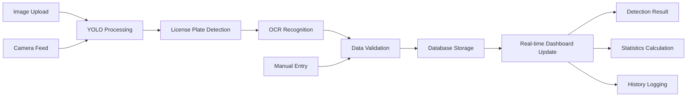
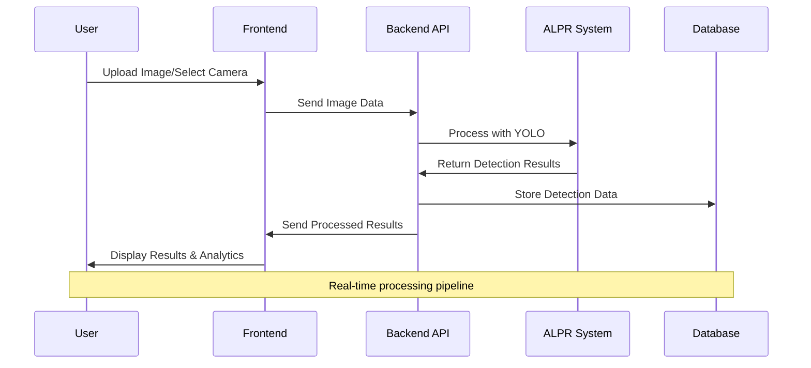

# Galaxy ALPR System - Frontend Documentation

## Project Overview

<div align="center" style="display: flex; align-items: center; justify-content: center; height: 200px;">
  
  <span style="font-size: 24px; font-weight: bold; margin: 0 20px;">X</span>
  
</div>


The Galaxy ALPR System is a comprehensive **Automatic License Plate Recognition (ALPR)** application designed specifically for Indonesian vehicles. This modern web application provides real-time vehicle detection, license plate recognition, and parking management capabilities through an intuitive dashboard interface.

### Purpose

- **Vehicle Detection**: Automatic recognition of cars and motorcycles entering/exiting parking facilities
- **License Plate Recognition**: High-accuracy OCR processing for Indonesian license plates with advanced entity detection
- **Traffic Management**: Real-time monitoring and analytics for parking operations
- **Data Analytics**: Comprehensive reporting and statistical analysis with interactive charts
- **Configuration Management**: Advanced detection area setup and camera integration
- **Access Control**: Blacklist/Whitelist management for enhanced security

## Tech Stack

- **Frontend Framework**: React 19.1.0 with TypeScript 4.9.5
- **Styling**: Tailwind CSS 3.3.0 (core utility classes only)
- **State Management**: React Hooks (`useState`, `useEffect`, `useRef`, `useCallback`)
- **Routing**: React Router DOM 7.6.1
- **Testing**: React Testing Library & Jest DOM
- **Charts & Analytics**: Recharts 2.15.3
- **Icons**: Lucide React v0.511.0:
  - Lucide React 0.511.0
  - Phosphor React 1.4.1
- **Build Tool**: `react-scripts` (Create React App)
- **Package Manager**: npm or yarn

## Core Architecture

### Application Structure

The application follows a modular architecture with three main sections accessible via tabs:

1.  **Detection Area Setup** - Camera configuration and detection zone definition
2.  **Access List Management** - Blacklist/Whitelist plate management
3.  **Location Management** - Gate and location configuration

### Component Hierarchy

```
App
├── Routes
│   ├── LoginPage (galaxy-alpr-login.tsx)
│   └── ProtectedLayout (wrapper for authenticated routes)
│       ├── Background (Global background component)
│       ├── Sidebar (Navigation)
│       ├── Header (Top navigation bar)
│       ├── Main Content Pages
│       │   ├── HomePage (galaxy-alpr-dashboard.tsx)
│       │   │   ├── ImageTab
│       │   │   └── WebcamTab
│       │   ├── ResultsPage (galaxy-alpr-results.tsx)
│       │   │   ├── ImageComparisonTab
│       │   │   └── DetectionDetailsTab
│       │   ├── StatisticsPage (galaxy-alpr-statistics.tsx)
│       │   ├── HistoryPage (galaxy-alpr-history.tsx)
│       │   ├── UserManagementPage (galaxy-alpr-users.tsx)
│       │   ├── DetectionConfigPage (galaxy-alpr-config.tsx)
│       │   │   ├── DetectionAreaTab
│       │   │   ├── AccessListTab
│       │   │   └── LocationManagementTab
│       │   └── DocumentationPage (galaxy-alpr-documentation.tsx)
│       └── Footer

```

## Page Components

### 1. Login Page (`galaxy-alpr-login.tsx`)

<p align="center">
  
</p>

The Login Page serves as the authentication gateway to the Galaxy ALPR System, featuring a modern design with advanced visual effects and secure form handling.

#### Form Management

**State Structure:**
```typescript
const [formData, setFormData] = useState({
  username: "",
  password: "",
});
```

**Input Handling:**
```typescript
const handleInputChange = (e: React.ChangeEvent<HTMLInputElement>) => {
  const { name, value } = e.target;
  setFormData((prev) => ({
    ...prev,
    [name]: value,
  }));
};
```

#### Authentication Flow

**Current Implementation:**
- Form validation is currently commented out for development ease
- Direct navigation to dashboard upon submission
- Console logging for debugging purposes

**Prepared Validation Logic:**
```typescript
if (!username || !username.endsWith('@gmail.com')) {
  errors.push("Username must end with '@gmail.com'.");
}
if (!password || password.length < 6) {
  errors.push("Password must be at least 6 characters long.");
}
```

**Navigation Integration:**
```typescript
const handleSubmit = () => {
  const { username, password } = formData;
  const errors: string[] = [];
  
  if (errors.length > 0) {
    alert(errors.join("\n"));
    return;
  }
  
  console.log("Login attempt:", formData);
  navigate("/dashboard");
};
```

#### Security Considerations

**Development vs Production:**
- Validation logic prepared but disabled for development
- Console logging for debugging (should be removed in production)
- Form data structure ready for secure transmission

**Future Enhancements:**
- JWT token integration
- Remember me functionality
- Password strength validation
- Account lockout protection
- Two-factor authentication support

### 2. Home Page (`galaxy-alpr-dashboard.tsx`)

<div align="center" style="display: flex; justify-content: center; gap: 20px;">
  
  
</div>

The Home Page serves as the entry point for ALPR operations, allowing users to perform vehicle and plate recognition through image uploads or real-time webcam feeds.

#### Core Features

- **Tab Navigation:**
- **Image Upload Tab**: Users can upload images directly for detection.
- **Webcam Tab**: Enables live camera feed for real-time recognition.
- **Green Box Cropping**: Webcam captures are cropped to a defined polygon (green box) for focused detection.
- **Image Preprocessing**: Captured or uploaded images are converted to base64 and sent to the backend API.
- **Detection Workflow**:
  - Image sent via POST to `/detect/image`
  - Backend returns annotated vehicle and plate images
  - Success message with navigation to results or history
- **Camera Device Selection**: Detects all available cameras using `navigator.mediaDevices`.

#### Webcam Cropping

```typescript
function cropImageToGreenBox(video: HTMLVideoElement): Promise<string> {
  const width = video.videoWidth;
  const height = video.videoHeight;
  const points = GREEN_BOX_POINTS.map((p) => ({
    x: p.x * width,
    y: p.y * height,
  }));

  const minX = Math.min(...points.map((p) => p.x));
  const maxX = Math.max(...points.map((p) => p.x));
  const minY = Math.min(...points.map((p) => p.y));
  const maxY = Math.max(...points.map((p) => p.y));

  const canvas = document.createElement("canvas");
  canvas.width = maxX - minX;
  canvas.height = maxY - minY;
  const ctx = canvas.getContext("2d")!;

  ctx.clip();
  ctx.drawImage(
    video,
    minX,
    minY,
    canvas.width,
    canvas.height,
    0,
    0,
    canvas.width,
    canvas.height
  );
  return Promise.resolve(canvas.toDataURL("image/png"));
}
```

#### Detection API Integration

```typescript
const handleProcessDetection = async () => {
  if (!uploadedImage) return;
  const blob = await (await fetch(uploadedImage)).blob();
  const file = new File([blob], "image.png", { type: "image/png" });

  const formData = new FormData();
  formData.append("file", file);

  const response = await fetch("http://localhost:8000/detect/image", {
    method: "POST",
    body: formData,
  });

  const result = await response.json();
  setProcessResult(result);
};
```

### 3. Results Page (`galaxy-alpr-results.tsx`)

<div align="center" style="display: flex; justify-content: center; gap: 20px;">
  
  
</div>

Advanced detection results display with comprehensive analysis and image comparison.

#### Enhanced Detection Data Structure

```typescript
interface DetectionResult {
  id: string;
  entity_type?:
    | "vehicle_with_plate"
    | "vehicle_without_plate"
    | "standalone_plate"
    | "no_detection";
  vehicle_index?: number;
  plate_index?: number;
  plateNumber: string;
  confidence: number;
  plateType: "Military" | "Regular";
  isBlacklist: "Blacklist" | "Whitelist";
  vehicleType: string;
  detectedTime: string;
  gateLocation: string;

  // Enhanced image paths
  originalImage: string;
  plateImage: string;
  storedOriginalPath: string;
  vehicleAnnotatedPath: string;
  vehicleImagePath: string;
  plateImagePath: string;

  // Technical metadata
  processingTime: string;
  imageResolution: string;
  plateTextColor: string;
  plateBackgroundColor: string;
  plateRegion: string;
  algorithm: string;
}
```

#### Advanced Features

**Entity Type Detection:**

- **Vehicle with Plate**: Complete detection with both vehicle and readable plate
- **Vehicle without Plate**: Vehicle detected but no readable plate
- **Standalone Plate**: Plate detected without associated vehicle
- **No Detection**: No entities found

**Dynamic Image Loading:**

```typescript
// Smart image URL handling with backend integration
const getImageUrl = (path: string): string => {
  if (!path) return "/api/placeholder/300/200";
  if (path.startsWith("http")) return path;
  if (path.startsWith("/")) return `${backendUrl}${path}`;
  return `${backendUrl}/${path}`;
};
```

**Error Handling and Loading States:**

- Comprehensive error handling for API failures
- CORS-specific error detection and messaging
- Loading spinners and fallback states
- Graceful image loading with error fallbacks

#### Tabbed Analysis Interface

**Image Comparison Tab:**

- Side-by-side original and annotated image display
- Entity-specific image grids based on detection type
- Dynamic layout adaptation for different entity types

**Detection Details Tab:**

- Comprehensive metadata display
- Technical details including confidence scores
- Color-coded plate type indicators
- Processing time and resolution information

### 4. Statistics Page (`galaxy-alpr-statistics.tsx`)

<div align="center" style="display: flex; justify-content: center; gap: 20px;">
  
</div>

Comprehensive analytics dashboard with interactive charts and KPI cards.

#### Statistics Architecture

```typescript
// KPI Cards with trend indicators
interface StatCard {
  title: string;
  value: string;
  change: string;
  trend: "up" | "down";
}

// Chart data structures
const detectionTrendData = [
  { date: "15 May", detections: 35 },
  // ... time series data
];

const vehicleDistributionData = [
  { name: "Cars", value: 812, color: "#3B82F6" },
  { name: "Motorcycles", value: 436, color: "#10B981" },
];
```

#### Chart Components Integration

**Custom Chart Components:**

- `CustomPieChart` - For distribution analysis
- `CustomBarChart` - For categorical data
- `CustomLineChart` - For trend analysis
- `ChartCard` - Wrapper component with consistent styling

**Chart Types:**

- **Detection Trend** (Line Chart): Daily detection patterns over time
- **Hourly Activity** (Bar Chart): 24-hour traffic distribution
- **Vehicle Distribution** (Pie Chart): Vehicle type breakdown
- **Plate Type Distribution** (Pie Chart): Plate type classification
- **Blacklist/Whitelist Distribution** (Pie Chart): Access classification
- **Region Distribution** (Pie Chart): Plate region distribution

### 5. History Page (`galaxy-alpr-history.tsx`)

<div align="center" style="display: flex; justify-content: center; gap: 20px;">
  
  
  
</div>

The History Page displays all previously processed detections in a paginated, filterable table.

#### Functional Highlights

- **Record Retrieval**:
  - Fetches paginated data from `/detections` API
  - Supports filters by vehicle type and plate type
  - Full-text search on plate number
- **Pagination**: Page control with navigation to first/last and numeric page buttons
- **Data Export**: Export current view to CSV format
- **Image Previews**:
  - Annotated entry/exit image
  - Cropped plate image
- **Metadata Display**:
  - Plate Number, Confidence %, Plate Type, Region, Vehicle Type
- **Modals**:
  - **Delete Confirmation**: Prompt before deleting record
  - **Edit Detail Modal**: Interface to edit a record
  - **Image Preview Modal**: Fullscreen annotated or plate image

#### Fetching Paginated Records

```typescript
const fetchDetectionRecords = async (page = 1) => {
  const offset = (page - 1) * recordsPerPage;
  let url = `http://localhost:8000/detections?limit=${recordsPerPage}&offset=${offset}`;

  if (vehicleTypeFilter !== "all") url += `&vehicleType=${vehicleTypeFilter}`;
  if (plateTypeFilter !== "all") url += `&plateType=${plateTypeFilter}`;
  if (searchQuery.trim()) url += `&search=${encodeURIComponent(searchQuery)}`;

  const response = await fetch(url);
  const data = await response.json();
  setDetectionRecords(data.detections);
  setTotalEntries(data.count || 0);
};
```

#### Image Fallback Logic

```typescript
const handleImageError = (
  e: React.SyntheticEvent<HTMLImageElement, Event>,
  type: string = ""
) => {
  const img = e.currentTarget;
  console.error(`Image failed [${type}]:`, img.src);
  img.src = "https://via.placeholder.com/80x60?text=No+Image";
  img.alt = "Image not found";
  img.onerror = null;
};
```

#### Export to CSV

```typescript
const exportToCSV = () => {
  const headers = [
    "ID",
    "Entry Time",
    "Exit Time",
    "Plate",
    "Vehicle",
    "Region",
    "Type",
    "Confidence",
  ];
  const rows = detectionRecords.map((r) => [
    r.id,
    r.timestampEntry,
    r.timestampExit,
    r.plateNumber,
    r.vehicleType,
    r.region,
    r.plateType,
    r.confidence.toFixed(1),
  ]);

  const csv = [headers.join(","), ...rows.map((row) => row.join(","))].join(
    "\n"
  );
  const blob = new Blob([csv], { type: "text/csv" });
  const url = URL.createObjectURL(blob);
  const a = document.createElement("a");
  a.href = url;
  a.download = `detection-history-${new Date().toISOString().slice(0, 10)}.csv`;
  a.click();
};
```

### 6. Detection Configuration Page (`galaxy-alpr-config.tsx`)

<div align="center" style="display: flex; justify-content: center; gap: 20px;">
  
</div>

The main configuration interface with tabbed navigation for system setup.

#### State Management

```typescript
// Location and tab management
const [selectedParkingPark, setSelectedParkingPark] =
  useState("Parking Park 1");
const [activeTab, setActiveTab] = useState<"area" | "list" | "location">(
  "area"
);

// Access list management
const [plates, setPlates] = useState<
  { plate: string; type: "blacklist" | "whitelist" }[]
>([]);
const [newPlate, setNewPlate] = useState("");
const [newType, setNewType] = useState<"blacklist" | "whitelist">("blacklist");

// Camera and location setup
const [selectedLocation, setSelectedLocation] = useState<string>(
  LOCATION_OPTIONS[0]
);
const [cameraDevices, setCameraDevices] = useState<MediaDeviceInfo[]>([]);
const [selectedCameraId, setSelectedCameraId] = useState<string>("");

// Detection area polygon points
const [areaPoints, setAreaPoints] = useState<Point[]>([
  { x: 150, y: 300 },
  { x: 450, y: 280 },
  { x: 500, y: 350 },
  { x: 100, y: 370 },
]);
```

#### Key Features

**Detection Area Setup:**

- Interactive polygon drawing on camera feed
- Drag-and-drop point manipulation
- Real-time camera integration via `navigator.mediaDevices`
- Automatic coordinate scaling for different resolutions
- Save functionality with actual camera resolution mapping

**Access List Management:**

- Dynamic blacklist/whitelist plate management
- Add/remove plate numbers with type classification
- Real-time list updates

**Location Management:**

- Dynamic location creation and deletion
- Gate location selection (Gate 1-4 Entrance/Exit)
- Location-based configuration persistence

#### Advanced Camera Integration

```typescript
// Camera stream management with cleanup
useEffect(() => {
  let stream: MediaStream;

  if (activeTab === "area" && selectedCameraId) {
    navigator.mediaDevices
      .getUserMedia({
        video: { deviceId: { exact: selectedCameraId } },
      })
      .then((mediaStream) => {
        stream = mediaStream;
        streamRef.current = mediaStream;
        if (videoRef.current) {
          videoRef.current.srcObject = mediaStream;
        }
      })
      .catch((err) => {
        if (videoRef.current) {
          videoRef.current.srcObject = null;
        }
      });
  }

  // Cleanup on tab change or unmount
  return () => {
    if (stream) {
      stream.getTracks().forEach((track) => track.stop());
    }
  };
}, [selectedCameraId, activeTab]);
```

#### Interactive Detection Area

The detection area setup uses advanced pointer event handling for smooth polygon manipulation:

```typescript
// Stable event handlers using useCallback
const handleWindowPointerMove = useCallback((e: PointerEvent) => {
  if (draggingIdxRef.current === null) return;
  const svg = document.getElementById("detection-area-svg");
  if (!svg) return;
  const rect = svg.getBoundingClientRect();
  const x = ((e.clientX - rect.left) / rect.width) * 600;
  const y = ((e.clientY - rect.top) / rect.height) * 400;

  setAreaPoints((pts) =>
    pts.map((pt, i) =>
      i === draggingIdxRef.current
        ? {
            x: Math.max(0, Math.min(600, x)),
            y: Math.max(0, Math.min(400, y)),
          }
        : pt
    )
  );
}, []);
```

### 7. Documentation Page (`galaxy-alpr-documentation.tsx`)

<div align="center" style="display: flex; justify-content: center; gap: 20px;">
  
</div>

Provides in-app reference for end-users and administrators.

#### Documentation Content:

- **System Overview**: Architecture and flow of vehicle detection and recognition
- **User Guide**: Instructions for using each module:
  - Dashboard
  - History
  - Statistics
  - Detection Config
- **Glossary**: Definitions of key terms like confidence score, plate types, region, etc.
- **Support Info**: Links or instructions for reaching out to system admins

### 8. User Management Page (`galaxy-alpr-users.tsx`)

<div align="center" style="display: flex; justify-content: center; gap: 20px;">
  
</div>

Admin-only interface for managing users and viewing operator statistics.

#### Features:

- **User Role Segmentation**:
  - Super Admin: Full access
  - Admin: Limited to managing Operators
  - Operator: View only
- **Live Status View**: Online/Offline with color-coded badges
- **Search**: Filter users by name or email
- **Pagination**: Per-page user management
- **Profile Card**:
  - Editable avatar and name
  - Read-only fields for email and role
- **User Actions** (Admin/Super Admin only):
  - Add, Edit, Delete users via dropdown menu
- **Color-Coding**:
  - Super Admin: Purple
  - Admin: Green
  - Operator: Cyan

#### User Search, Sort, and Paginate

```typescript
const filteredUsers = allUsers
  .filter(
    (user) =>
      user.name.toLowerCase().includes(search.toLowerCase()) ||
      user.email.toLowerCase().includes(search.toLowerCase())
  )
  .sort((a, b) => positionOrder[a.position] - positionOrder[b.position]);

const pagedUsers = filteredUsers.slice(
  (currentPage - 1) * recordsPerPage,
  currentPage * recordsPerPage
);
```

#### Dynamic Badge Styling

```typescript
const getPositionColor = (position: string) => {
  switch (position) {
    case "Super Admin":
      return "bg-purple-500 text-white";
    case "Admin":
      return "bg-green-700 text-white";
    case "Operator":
      return "bg-cyan-500 text-white";
    default:
      return "bg-gray-500 text-white";
  }
};

const getStatusColor = (status: string) => {
  return status === "Online"
    ? "bg-green-500 text-white"
    : "bg-gray-400 text-white";
};
```

#### Profile Picture Update

```typescript
const handleProfilePicChange = (e: React.ChangeEvent<HTMLInputElement>) => {
  if (e.target.files?.[0]) {
    const reader = new FileReader();
    reader.onload = (ev) => {
      setProfilePic(ev.target?.result as string);
    };
    reader.readAsDataURL(e.target.files[0]);
  }
};
```

## State Management Patterns

### Data Flow Patterns



## User Interaction Flow



## API Integration

### Backend Communication

```typescript
// API base configuration
const backendUrl = "http://localhost:8000";

// Latest detection data fetching
const fetchLatestDetection = async () => {
  try {
    const response = await fetch(
      `${backendUrl}/api/detection/latest?_=${new Date().getTime()}`,
      {
        method: "GET",
        headers: {
          Accept: "application/json",
        },
      }
    );

    if (!response.ok) {
      throw new Error(
        `API returned status: ${response.status} ${response.statusText}`
      );
    }

    const data = await response.json();
    return data;
  } catch (error) {
    // Handle CORS and network errors
    console.error("API Error:", error);
    throw error;
  }
};
```

### Error Handling Strategy

**CORS Detection:**

```typescript
if (err instanceof TypeError && err.message.includes("fetch")) {
  setError(
    "CORS error: Cannot connect to the backend server. Make sure the backend is running and CORS is configured properly."
  );
}
```

**Graceful Degradation:**

- Fallback images for failed loads
- Error states with retry mechanisms
- Loading states for better UX

## Performance Optimizations

### Component Optimization

**Stable References:**

```typescript
// Use refs for values that don't need re-renders
const draggingIdxRef = useRef<number | null>(null);

// Memoized event handlers
const handlePointerDown = useCallback(
  (idx: number) => (e: React.PointerEvent) => {
    setDraggingIdx(idx);
    // ... handler logic
  },
  []
);
```

**Resource Management:**

```typescript
// Camera stream cleanup
useEffect(() => {
  return () => {
    if (streamRef.current) {
      streamRef.current.getTracks().forEach((track) => track.stop());
      streamRef.current = null;
    }
  };
}, [selectedCameraId, activeTab]);
```

### Data Processing

**Efficient State Updates:**

```typescript
// Batch state updates for better performance
setAreaPoints((pts) =>
  pts.map((pt, i) =>
    i === draggingIdxRef.current
      ? { x: Math.max(0, Math.min(600, x)), y: Math.max(0, Math.min(400, y)) }
      : pt
  )
);
```

## Development Setup

### Prerequisites

- Node.js 18+ and npm/yarn
- Modern web browser with camera support
- Backend API server running on localhost:8000

### Installation Steps

1.  **Clone and Install**

```bash
git clone https://github.com/your-org/bss-parking-system.git
cd bss-parking-system
npm install
```

2.  **Environment Configuration**

```env
REACT_APP_API_BASE_URL=http://localhost:8000
REACT_APP_UPLOAD_MAX_SIZE=10MB
REACT_APP_SUPPORTED_FORMATS=jpg,jpeg,png
REACT_APP_DETECTION_CONFIDENCE_THRESHOLD=0.8
```

3.  **Development Server**

```bash
npm run dev
```

### Project Structure

```
frontend/
├── public/
│   ├── assets/
│   └── ...
├── src/
│   ├── components/
│   │   ├── config/
│   │   │   ├── access-list-tab.tsx
│   │   │   ├── detection-area-tab.tsx
│   │   │   └── location-management-tab.tsx
│   │   ├── dashboard/
│   │   │   └── dashboard-content.tsx
│   │   ├── history/
│   │   │   ├── delete-confirmation-modal.tsx
│   │   │   ├── edit-detail-modal.tsx
│   │   │   └── image-preview-modal.tsx
│   │   ├── statistics/
│   │   │   ├── chart-card.tsx
│   │   │   ├── custom-barchart.tsx
│   │   │   ├── custom-linechart.tsx
│   │   │   └── custom-piechart.tsx
│   │   ├── users/
│   │   │   ├── profile-card.tsx
│   │   │   └── user-list-card.tsx
│   │   ├── background.tsx
│   │   ├── delete-confirmation-modal.tsx
│   │   ├── header.tsx
│   │   └── sidebar.tsx
│   ├── pages/
│   │   ├── galaxy-alpr-config.tsx
│   │   ├── galaxy-alpr-dashboard.tsx
│   │   ├── galaxy-alpr-documentation.tsx
│   │   ├── galaxy-alpr-history.tsx
│   │   ├── galaxy-alpr-login.tsx
│   │   ├── galaxy-alpr-results.tsx
│   │   ├── galaxy-alpr-statistics.tsx
│   │   └── galaxy-alpr-users.tsx
│   ├── utils/
│   │   ├── image-utils.ts
│   ├── App.css
│   ├── App.js
│   └── ...

```

## Configuration Options

### Detection Area Setup

- **Interactive Polygon Drawing**: Click and drag to define detection zones
- **Coordinate Scaling**: Automatic scaling between preview and actual camera resolution
- **Multiple Area Support**: Define multiple detection zones per camera

### Camera Integration

- **Device Enumeration**: Automatic detection of available video input devices
- **Stream Management**: Proper resource cleanup and error handling
- **Resolution Support**: Configurable video resolution settings

### Access Control

- **Dynamic Lists**: Real-time blacklist/whitelist management
- **Plate Validation**: Input validation for Indonesian plate formats
- **Bulk Operations**: Support for batch plate management

## Deployment Considerations

### Production Build

```bash
npm run build
```

### Environment Variables

```env
REACT_APP_API_BASE_URL=https://your-api-domain.com
REACT_APP_ENABLE_ANALYTICS=true
REACT_APP_LOG_LEVEL=warn
```

### Security Considerations

- HTTPS required for camera access
- CORS configuration for API communication
- Input validation for all user inputs
- Secure handling of detection data

## Future Enhancements

### Planned Features

- Real-time WebSocket integration
- Advanced analytics with AI insights
- Multi-language support
- Advanced reporting exports

### Technical Improvements

- Service Worker for offline functionality
- Advanced caching strategies
- Progressive Web App features
- Enhanced accessibility compliance

## License

© 2025 Galaxy Dev. All rights reserved.

---

**System Version**: v1.0.0  
**React Version**: 19.1.0  
**Last Updated**: June 2025  
**Documentation Version**: 1.0
