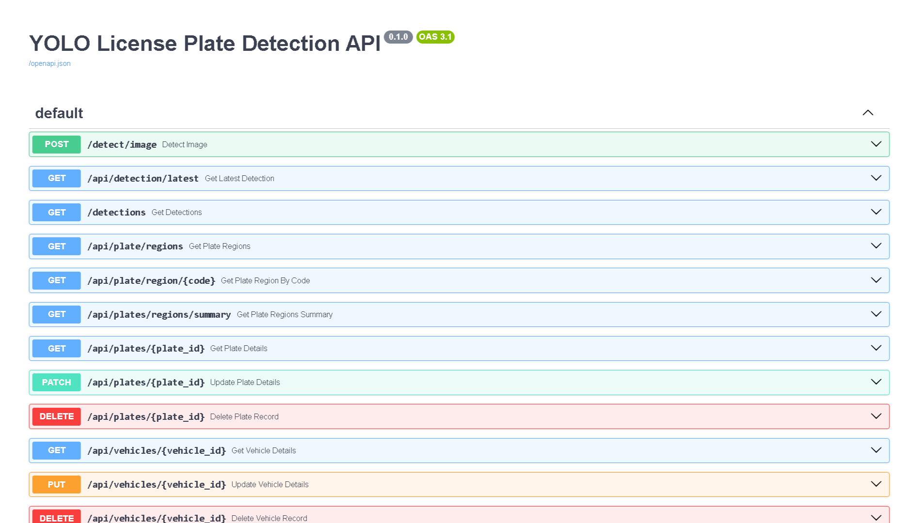
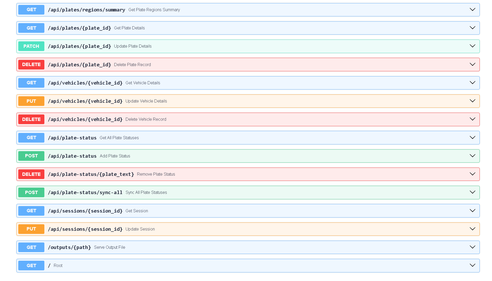
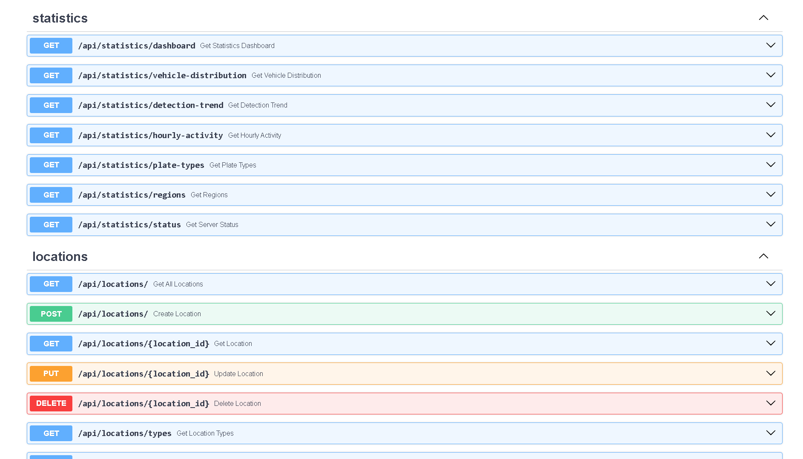
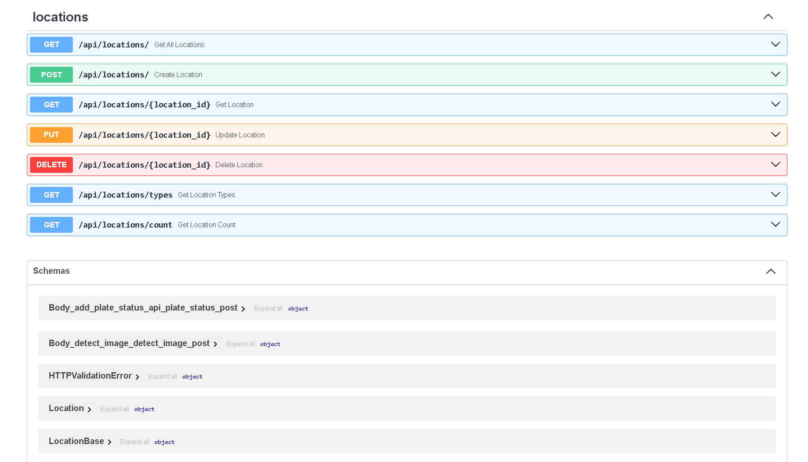
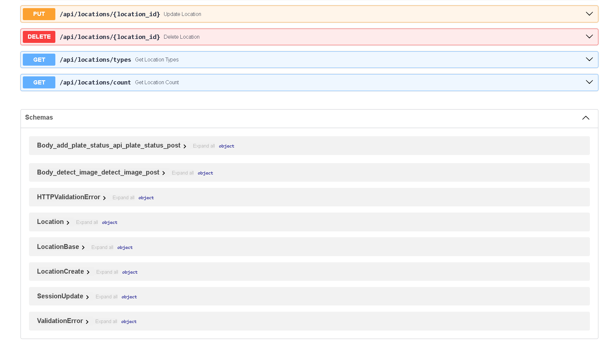

# Galaxy ALPR REST API

A robust REST API service for the Galaxy Automatic License Plate Recognition (ALPR) system. This backend powers real-time vehicle and license plate detection, integrates with AI/ML models for image analysis, manages detection data in a database, and serves results to a modern frontend dashboard.

## 🚀 Features

- **Image Upload & Detection**
  - Upload vehicle/plate images for AI-powered detection
  - Returns annotated images, detection metadata, and confidence scores

- **Detection Results & History**
  - Fetch latest detection results
  - Paginated history of all detection events
  - Detailed record retrieval by vehicle or plate ID

- **Plate & Vehicle Management**
  - CRUD operations for vehicle and plate records
  - Region and type classification for plates
  - Blacklist/whitelist management for access control

- **Statistics & Analytics**
  - Real-time statistics for dashboard KPIs
  - Vehicle/plate distribution, detection trends, and region analytics

- **Location & Session Management**
  - Manage entry/exit locations
  - Update and retrieve detection sessions

- **Static & Output File Serving**
  - Download annotated images and detection artifacts

- **Health & Status Endpoints**
  - API and database health checks

---

## 🛠️ Tech Stack

- **API Framework:** Python 3.10+, FastAPI, Uvicorn
- **Database:** SQLite, SQLAlchemy ORM
- **AI/ML Integration:** YOLOv8/YOLOv11 (PyTorch), OCR (Gemini)
- **HTTP Client:** httpx (for internal API calls)
- **Logging:** Python logging module
- **CORS:** FastAPI Middleware

---

## ⚡ Setup Guide

1. **Clone the Repository**
   ```bash
   git clone https://github.com/your-org/galaxy-alpr-backend.git
   cd galaxy-alpr-backend/backend-api-endpoint
   ```

2. **Create and Activate a Virtual Environment**
   ```bash
   python -m venv venv
   source venv/bin/activate  # On Windows: venv\Scripts\activate
   ```

3. **Install Dependencies**
   ```bash
   pip install -r requirements.txt
   ```

4. **Configure Environment Variables**
   - Copy `.env.example` to `.env` and update values as needed.

5. **Run the Development Server**
   ```bash
   uvicorn app:app --reload
   ```
   The API will be available at [http://localhost:8000](http://localhost:8000).

---

## 🔑 Environment Variables

Create a `.env` file in the project root with the following variables:

```env
GEMINI_API_KEY=your-gemini-api-key
```

- `GEMINI_API_KEY`: API key for Gemini OCR

---

## 📚 API Documentation

Interactive Swagger UI is available at:  
[http://localhost:8000/docs](http://localhost:8000/docs)

### Example Endpoints

- **POST** `/detect_image`  
  Upload an image for detection.  
  **Input:** multipart/form-data (`file`)  
  **Output:** JSON with detection results, image URLs

- **GET** `/latest_detection`  
  Fetch the most recent detection result.

- **GET** `/detections?limit=10&offset=0`  
  Paginated list of detection events.

- **GET** `/api/vehicles/{vehicle_id}`  
  Get detailed info for a specific vehicle.

- **GET** `/api/plates/{plate_id}`  
  Get detailed info for a specific plate.

- **POST** `/api/plate-status`  
  Add a plate to whitelist/blacklist.

- **GET** `/api/statistics/dashboard`  
  Get dashboard statistics for frontend.

See `/docs` or `/redoc` for the full OpenAPI schema.

---

## 🖼️ API Documentation Preview

Below is a screenshot of the interactive Swagger UI, which provides a convenient way to explore and test all available API endpoints:

<div style="display: flex; justify-content: center; padding: 2rem;">
  <div style="display: grid; grid-template-columns: repeat(2, 1fr); gap: 2rem; justify-items: center;">
    
    
  </div>
</div>

<div style="display: flex; justify-content: center; padding: 2rem;">
  <div style="display: grid; grid-template-columns: repeat(2, 1fr); gap: 2rem; justify-items: center;">
    
    
  </div>
</div>

<div style="display: flex; justify-content: center; padding: 2rem;">
  
</div>

> The Swagger UI is accessible at [http://localhost:8000/docs](http://localhost:8000/docs) after starting the server.

*For the latest endpoints and schemas, always refer to the live Swagger docs.*

---

## 📁 Folder Structure

```
backend-api-endpoint/
│
├── app.py                 # Main FastAPI application and entry point
├── endpoints/             # Modular API endpoint definitions
│   ├── detect_image.py
│   ├── latest_detection.py
│   ├── detections.py
│   ├── plate_regions.py
│   ├── plate_queries.py
│   ├── vehicle_queries.py
│   ├── statistics.py
│   ├── plate_status.py
│   ├── session_queries.py
│   └── location_routes.py
├── PlateDetector.py       # AI/ML logic for plate and vehicle detection
├── database.py            # Database connection and ORM logic
├── requirements.txt       # Python dependencies
├── outputs/               # Output images, crops, and detection artifacts
├── uploads/               # Temporary storage for uploaded images
├── static/                # Static files served by FastAPI
├── .env                   # Environment variables
└── README.md              # This documentation
```


---

## 📡 API Overview

### 🔑 Key Endpoints

#### Detection & Image Processing
| Method | Endpoint                       | Description                                 |
| ------ | ------------------------------ | ------------------------------------------- |
| POST   | `/detect/image`                | Upload an image for vehicle/plate detection |
| GET    | `/api/detection/latest`        | Fetch the most recent detection result      |
| GET    | `/detections`                  | List all detection events                   |
| GET    | `/outputs/{path}`              | Download detection result artifacts         |

#### Vehicle Management
| Method | Endpoint                       | Description                                 |
| ------ | ------------------------------ | ------------------------------------------- |
| GET    | `/api/vehicles/{vehicle_id}`   | Get vehicle details by ID                   |
| PUT    | `/api/vehicles/{vehicle_id}`   | Update vehicle details                      |
| DELETE | `/api/vehicles/{vehicle_id}`   | Delete a vehicle and related plates         |

#### Plate Management
| Method | Endpoint                       | Description                                 |
| ------ | ------------------------------ | ------------------------------------------- |
| GET    | `/api/plates/{plate_id}`       | Get plate details by ID                     |
| PATCH  | `/api/plates/{plate_id}`       | Update plate details                        |
| DELETE | `/api/plates/{plate_id}`       | Delete a plate and cascade if needed        |
| GET    | `/api/plate/regions`           | Get all plate region mappings               |
| GET    | `/api/plate/region/{code}`     | Get region name for a code                  |

#### Plate Status (Whitelist/Blacklist)
| Method | Endpoint                             | Description                                 |
| ------ | ------------------------------------ | ------------------------------------------- |
| GET    | `/api/plate-status`                  | List all plate statuses                     |
| POST   | `/api/plate-status`                  | Add plate to whitelist/blacklist            |
| DELETE | `/api/plate-status/{plate_text}`     | Remove plate from status list               |
| POST   | `/api/plate-status/sync-all`         | Sync all plate statuses                     |

#### Statistics & Analytics
| Method | Endpoint                                      | Description                                 |
| ------ | --------------------------------------------- | ------------------------------------------- |
| GET    | `/api/statistics/dashboard`                   | Get dashboard statistics                    |
| GET    | `/api/statistics/vehicle-distribution`        | Vehicle distribution data                   |
| GET    | `/api/statistics/detection-trend`             | Detection trend data                        |
| GET    | `/api/statistics/hourly-activity`             | Hourly activity data                        |
| GET    | `/api/statistics/plate-types`                 | Plate type distribution                     |
| GET    | `/api/statistics/regions`                     | Plate region distribution                   |
| GET    | `/api/statistics/status`                      | API/database health                         |

#### Location Management
| Method | Endpoint                             | Description                                 |
| ------ | ------------------------------------ | ------------------------------------------- |
| GET    | `/api/locations/`                    | List all locations                          |
| POST   | `/api/locations/`                    | Create a new location                       |
| PUT    | `/api/locations/{location_id}`       | Update a location                           |
| DELETE | `/api/locations/{location_id}`       | Delete a location                           |

#### Static & Utility
| Method | Endpoint                       | Description                                 |
| ------ | ------------------------------ | ------------------------------------------- |
| GET    | `/static/{path}`               | Download static files                       |
| GET    | `/`                            | API root/health check                       |

### Example Inputs & Outputs

#### POST `/detect/image`

**Input:**  
Form-data:
- `file`: (image file, required)
- `location`: (string, optional)

**Example Request (curl):**
```bash
curl -F "file=@car.jpg" -F "location=Gate 1" http://localhost:8000/detect/image
```

**Example Output:**
```json
{
  "timestamp": "2025-06-07_12-34-56",
  "processing_time": 1.234,
  "stored_original_path": "outputs/uploaded/2025-06-07_12-34-56_uploaded-image.jpg",
  "detected_vehicle_image_path": "outputs/vehicles/2025-06-07_12-34-56_vehicle.jpg",
  "detected_plate_image_path": "outputs/plates/2025-06-07_12-34-56_plate.jpg",
  "image_resolution": "1920x1080",
  "session_id": 42,
  "location": "Gate 1",
  "list_vehicle_and_plate_information": [
    {
      "vehicle": {
        "vehicle_class": "car",
        "vehicle_confidence_score": 0.98,
        "vehicle_image_path": "outputs/vehicles/crops/abc123.jpg"
      },
      "plate": {
        "plate_text": "B123ABC",
        "ocr_confidence": 0.97,
        "plate_image_path": "outputs/plates/crops/xyz456.jpg"
      }
    }
  ]
}
```

---

#### GET `/api/detection/latest`

**Output:**
```json
[
  {
    "id": "42_v1_p1",
    "entity_type": "vehicle_with_plate",
    "vehicle_index": 1,
    "plate_index": 1,
    "plateNumber": "B123ABC",
    "confidence": 0.97,
    "plateType": "Regular",
    "plateStatus": "whitelist",
    "vehicleType": "car",
    "vehicleConfidence": 0.98,
    "detectedTime": "2025-06-07 12:34:56",
    "gateLocation": "Gate 1 (Entry)",
    "originalImage": "/outputs/uploaded/2025-06-07_12-34-56_uploaded-image.jpg",
    "plateImage": "/outputs/plates/crops/xyz456.jpg",
    "processingTime": "1.234s",
    "imageResolution": "1920x1080",
    "plateTextColor": "Black",
    "plateBackgroundColor": "White",
    "plateRegion": "B (Jakarta)",
    "algorithm": "YOLOv11"
  }
]
```

---

#### GET `/detections`

**Query Parameters:**  
- `limit` (int, default 100)
- `offset` (int, default 0)
- `vehicleType` (string, optional)
- `plateType` (string, optional)
- `search` (string, optional)

**Output:**
```json
{
  "detections": [
    {
      "id": 123,
      "detection_type": "plate",
      "timestamp": "2025-06-07 12:34:56",
      "original_path": "/outputs/uploaded/2025-06-07_12-34-56_uploaded-image.jpg",
      "file_path": "/outputs/plates/crops/xyz456.jpg",
      "annotated_path": "/outputs/plates/2025-06-07_12-34-56_plate.jpg",
      "processing_time": "1.23ms",
      "image_resolution": "1920x1080",
      "detection_details": {
        "vehicle_type": "car",
        "vehicle_confidence": 0.98,
        "plate_text": "B123ABC",
        "ocr_confidence": 0.97,
        "confidence": 0.97,
        "region": "B (Jakarta)",
        "plate_status": "whitelist"
      }
    }
  ],
  "count": 1
}
```

---

#### GET `/api/vehicles/{vehicle_id}`

**Output:**
```json
{
  "id": 1,
  "vehicle_class": "car",
  "vehicle_confidence_score": 0.98,
  "vehicle_image_path": "outputs/vehicles/crops/abc123.jpg",
  "vehicle_bounding_box": [100, 200, 300, 400],
  "timestamp": "2025-06-07 12:34:56",
  "plates": [
    {
      "id": 10,
      "plate_text": "B123ABC",
      "plate_bounding_box": [120, 220, 180, 260]
    }
  ]
}
```

---

#### PUT `/api/vehicles/{vehicle_id}`

**Input:**
```json
{
  "vehicle_class": "truck",
  "vehicle_confidence_score": 0.95
}
```

**Output:**
```json
{
  "message": "Successfully updated vehicle 1",
  "vehicle": {
    "id": 1,
    "vehicle_class": "truck",
    "vehicle_confidence_score": 0.95,
    ...
  }
}
```

---

#### DELETE `/api/vehicles/{vehicle_id}`

**Output:**
```json
{
  "message": "Successfully deleted vehicle 1 with 1 plate records",
  "vehicle_deleted": true,
  "plates_deleted": 1,
  "session_deleted": false
}
```

---

#### GET `/api/plates/{plate_id}`

**Output:**
```json
{
  "id": 10,
  "plate_text": "B123ABC",
  "plate_bounding_box": [120, 220, 180, 260],
  "plate_type": "Regular",
  "plate_status": "whitelist",
  "plate_region": "B (Jakarta)",
  "vehicle_class": "car",
  "timestamp": "2025-06-07 12:34:56"
}
```

---

#### PATCH `/api/plates/{plate_id}`

**Input:**
```json
{
  "plate_text": "B456XYZ",
  "plate_status": "blacklist"
}
```

**Output:**
```json
{
  "message": "Successfully updated plate 10",
  "plate": {
    "id": 10,
    "plate_text": "B456XYZ",
    "plate_status": "blacklist",
    ...
  }
}
```

---

#### DELETE `/api/plates/{plate_id}`

**Output:**
```json
{
  "message": "Successfully deleted plate 10 and its associated vehicle",
  "plate_deleted": true,
  "vehicle_deleted": true,
  "session_deleted": false
}
```

---

#### GET `/api/plate/regions`

**Output:**
```json
{
  "regions": [
    {"code": "B", "name": "Jakarta"},
    {"code": "D", "name": "Bandung"}
  ]
}
```

---

#### GET `/api/plate/region/{code}`

**Output:**
```json
{
  "code": "B",
  "name": "Jakarta"
}
```

---

#### GET `/api/statistics/dashboard`

**Output:**
```json
{
  "totalDetections": 1234,
  "vehicleDistribution": {"car": 900, "truck": 200, "motorcycle": 134},
  "detectionTrend": [
    {"date": "2025-06-01", "count": 100},
    {"date": "2025-06-02", "count": 120}
  ],
  "hourlyActivity": [
    {"hour": "08:00", "count": 50},
    {"hour": "09:00", "count": 70}
  ]
}
```

---

#### GET `/api/statistics/status`

**Output:**
```json
{
  "status": "online",
  "timestamp": "2025-06-07T12:34:56.789123",
  "database": {
    "accessible": true,
    "path": "detections.db",
    "available_methods": ["get_statistics_dashboard_data", ...],
    "missing_methods": []
  },
  "router": {
    "prefix": "/api/statistics",
    "tags": ["statistics"],
    "routes": [
      {"path": "/api/statistics/dashboard", "methods": ["GET"]},
      ...
    ]
  }
}
```

---

#### GET `/api/plate-status`

**Output:**
```json
{
  "status": "success",
  "plate_statuses": [
    {"plate_text": "B123ABC", "status": "whitelist"},
    {"plate_text": "D456XYZ", "status": "blacklist"}
  ]
}
```

---

#### POST `/api/plate-status`

**Input:**
```json
{
  "plate_text": "B123ABC",
  "status_type": "whitelist"
}
```

**Output:**
```json
{
  "status": "success",
  "message": "Plate B123ABC added to whitelist"
}
```

---

#### DELETE `/api/plate-status/{plate_text}`

**Output:**
```json
{
  "status": "success",
  "message": "Plate B123ABC removed from status list"
}
```

---

#### POST `/api/plate-status/sync-all`

**Output:**
```json
{
  "status": "success",
  "message": "Successfully synchronized 100 plate statuses",
  "details": {
    "whitelist": 60,
    "blacklist": 30,
    "unclassified": 10
  }
}
```

---

#### GET `/api/locations/`

**Output:**
```json
[
  {"id": 1, "name": "Gate 1", "type": "Entry", "timestamp": "2025-06-07 12:00:00"},
  {"id": 2, "name": "Gate 2", "type": "Exit", "timestamp": "2025-06-07 12:10:00"}
]
```

---

#### POST `/api/locations/`

**Input:**
```json
{
  "name": "Gate 3",
  "type": "Entry"
}
```

**Output:**
```json
{
  "id": 3,
  "name": "Gate 3",
  "type": "Entry",
  "timestamp": "2025-06-07 13:00:00"
}
```

---

#### PUT `/api/locations/{location_id}`

**Input:**
```json
{
  "name": "Gate 1A",
  "type": "Entry"
}
```

**Output:**
```json
{
  "id": 1,
  "name": "Gate 1A",
  "type": "Entry",
  "timestamp": "2025-06-07 12:00:00"
}
```

---

#### DELETE `/api/locations/{location_id}`

**Output:**
```json
{
  "message": "Location 1 deleted successfully"
}
```

---

#### GET `/outputs/{path}`

**Output:**  
Returns the requested file as a download (image or artifact).  
If not found, returns:
```json
{
  "detail": "File not found: {path}"
}
```

---

#### GET `/static/{path}`

**Output:**  
Returns the requested static file.

---

*For more endpoints and details, see the live Swagger UI at [http://localhost:8000/docs](http://localhost:8000/docs).*

---

## 📄 License

This backend system is developed and maintained by **@GalaxyDeveloper**.

---

## 🏷️ Citation

If you use **Galaxy ALPR REST API** in your research, academic paper, or production system, please cite:

```
Galaxy ALPR Backend - Modular Backend for AI-Powered License Plate Recognition
Developed by @GalaxyDeveloper (2025)
Includes FastAPI, YOLOv11n, OCR, and SQLite Integration
```

---

**Galaxy ALPR REST API** – Modular, scalable backend for intelligent vehicle and plate detection.
*Powered by FastAPI, YOLOv11n, OCR, and SQLite*

**Developed by @GalaxyDeveloper — 2025**

---